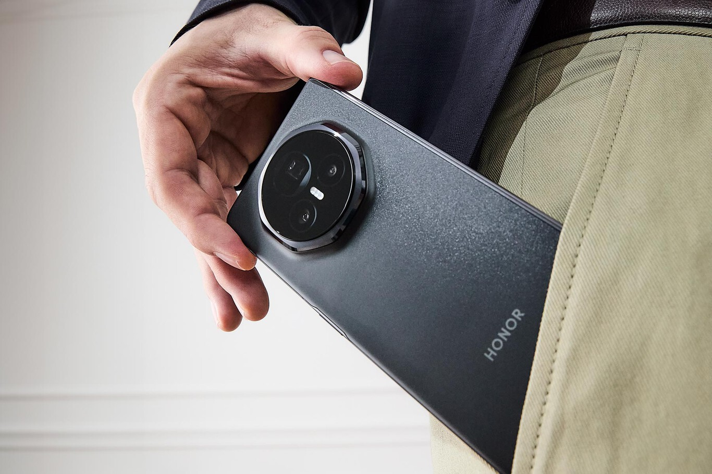

# Cuando lo tengas en la mano no darás crédito: el nuevo HONOR Magic V3 marca un récord entre los plegables y estos son los motivos
HONOR Magic V3 establece un récord en la industria: un grosor de 9,2 mm cuando está plegado, 4,35 mm desplegado y un peso de 226 gramos. ¿Quieres saber más?

Los smartphones plegables todavía son territorio desconocido para la mayoría de usuarios. Pero, por innovación y amplitud de pantalla, quedan pocas dudas de que con ellos se ha dado el salto hacia *una nueva generación de dispositivos móviles.*

Su **revolucionario formato expandible** reclama la atención de aquellos que están cansados de renovar sus terminales sin ninguna motivación o novedad especial. Entonces, ¿por qué hay todavía tantos potenciales compradores que no han dado el salto? La razón principal parece estar en la pérdida de comodidad en el uso, ya que la oferta actual de terminales se encuentra bastante penalizada por su **grosor y peso.**

La llegada del HONOR Magic V3 **supone un antes y un después** en el floreciente mercado prémium de los plegables en formato libro. A continuación,  vamos a conocer el perfeccionamiento tecnológico que ha introducido HONOR para convertirlo en un dispositivo disruptivo.

## **El plegable más delgado del mundo y ligero del mercado europeo**

Es una realidad, valoramos positivamente el menor grosor de un teléfono porque lo asociamos con **un diseño moderno, mejor portabilidad y avances tecnológicos.** Cuando aparecieron los primeros terminales plegables, aceptamos que cierto peaje a cambio de un mayor tamaño de pantalla cuando el teléfono estuviera desplegado.

Compañías como HONOR demostraron con el Magic V2 que era una situación que podría mejorarse. La nueva versión va un paso más allá y establece todo un récord en la industria: **un plegable con un grosor de 9,2 mm.** Es una cota que podemos medir con el teléfono cerrado, que impacta más al conocer cuál es **el grosor cuando es desplegado: solo 4,35 mm.**

Además de su delgadez, el **HONOR Magic V3 pesa únicamente 226 gramos**, convirtiéndose en una referencia del mercado de los dispositivos plegables tipo libro. Tanto el grosor como la ligereza ayudan a conformar un terminal con dos pantallas amplias, que es realmente confortable en mano.

## **Dos pantallas espectaculares que cuidan de nuestros ojos**

El HONOR Magic V3 cuenta con una pantalla externa de **6,43 pulgadas**, con unas proporciones (21:9) cómodas para **ser usada como si de un teléfono tradicional se tratara**, algo que otros muchos plegables descuidan. Cuando lo desplegamos, nos encontramos con una pantalla interna de **7,92 pulgadas** que transforman al teléfono en una tablet de pequeñas dimensiones.

La calidad de visualización de ambas pantallas del máximo nivel: **tecnología OLED de tipo LTPO**, 100% DCI-P3 y 120 Hz de refresco. Destaca también el nivel de brillo de la pantalla externa, que llega a los **5000 nits**, mientras que la interna se queda en 1600 nits. Cuentan con la **funcionalidad Always-on Display**, que permite disfrutar de la pantalla encendida durante todo el día.

Por su parte, la pantalla exterior cuenta con **tecnología de atenuación PWM a 4320 Hz** (3840 Hz en la interior). PWM (Modulación por Ancho de Pulso) es una técnica común en la que el brillo de la pantalla se controla encendiendo y apagando los LED de la pantalla a una velocidad muy alta, logrando que la visualización sea más cómoda y segura.

Para mejorar aún más la comodidad del usuario y reducir la fatiga ocular, el panel cuenta con atenuación dinámica que replica el ritmo natural de la luz. Equipado con una **pantalla nocturna circadiana**, el HONOR Magic V3 aprovecha la tecnología de inteligencia artificial para ajustar la temperatura de color del display.

[**VOLVER A LA PAGINA PRINCIPAL**](FrontPage.md)
